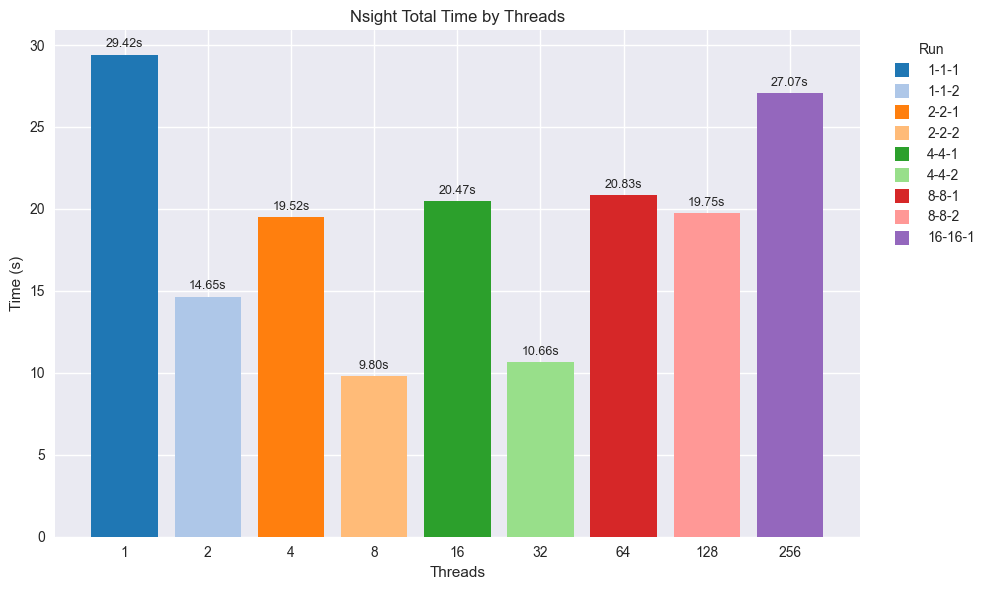

# Paralelizare Weeker Raytracer

- RestOfLife_CUDA (CUDA) - muta shading-ul per-sample pe GPU
- RestOfLife (pthreads) - inlocuieste buclele seriale cu un worker pool pthreads

## Problema rezolvata Randare imagine prin path tracing, cu esantionare per pixel (scanlines -> pixels -> samples).

- Output final in format PPM.

## Necesitatea paralelizarii

- Varianta seriala contine bucle pe scanlines, pixels si samples, iar pentru fiecare sample se genereaza un ray si se acumuleaza contributia de culoare.
- Logica de culoare este recursiva (color() / shade()), ceea ce inseamna calcul repetat per sample.
- Din aceste motive, am urmat doua strategii: mutarea shading-ului pe GPU (CUDA) si paralelizarea pe CPU cu pthreads.

## Implementare CUDA (RestOfLife_CUDA)

### Overview

```text
Am mutat shading-ul per-sample de pe CPU intr-un kernel CUDA, pastrand logica de randare originala, dar schimbind executia intr-un model GPU pe tile-uri si lane-uri de sample. Host-ul construieste scena flatten-uit, o incarca in device memory, lanseaza kernel-ul si apoi scrie PPM-ul final.
```

### Cod: varianta seriala (unparallelized) -> varianta CUDA (parallelized)

#### Unparallelized (RestOfLife_base)

```cpp
// main loop (scanlines -> pixels -> samples)
for (int j = ny-1; j >= 0; j--) {
  std::cerr << "\rScanlines remaining: " << j << ' ' << std::flush;
  for (int i = 0; i < nx; i++) {
    vec3 col(0, 0, 0);
    for (int s = 0; s < ns; s++) {
      float u = float(i + random_double()) / float(nx);
      float v = float(j + random_double()) / float(ny);
      ray r = cam->get_ray(u, v);
      col += de_nan(color(r, world, &hlist, 0));
    }
    col /= float(ns);
    col = vec3( sqrt(col[0]), sqrt(col[1]), sqrt(col[2]) );
    int ir = int(255.99*col[0]);
    int ig = int(255.99*col[1]);
    int ib = int(255.99*col[2]);
    std::cout << ir << " " << ig << " " << ib << "\n";
  }
}

// recursive shading
vec3 color(const ray& r, hittable *world, hittable *light_shape, int depth) {
  hit_record hrec;
  if (world->hit(r, 0.001, MAXFLOAT, hrec)) {
    scatter_record srec;
    vec3 emitted = hrec.mat_ptr->emitted(r, hrec, hrec.u, hrec.v, hrec.p);
    if (depth < 50 && hrec.mat_ptr->scatter(r, hrec, srec)) {
      if (srec.is_specular) {
        return srec.attenuation * color(srec.specular_ray, world, light_shape, depth+1);
      } else {
        hittable_pdf plight(light_shape, hrec.p);
        mixture_pdf p(&plight, srec.pdf_ptr);
        ray scattered = ray(hrec.p, p.generate(), r.time());
        float pdf_val = p.value(scattered.direction());
        delete srec.pdf_ptr;
        return emitted + srec.attenuation * hrec.mat_ptr->scattering_pdf(r, hrec, scattered)
          * color(scattered, world, light_shape, depth+1) / pdf_val;
      }
    } else {
      return emitted;
    }
  }
  return vec3(0,0,0);
}
```

#### Parallelized (CUDA)

```cpp
__global__ void render_kernel(float3 *pixels,
                              DeviceSceneView scene,
                              DeviceCamera cam,
                              int width,
                              int height,
                              int samples_per_pixel,
                              uint32_t base_seed) {
  int px = blockIdx.x * kTileX + threadIdx.x;
  int py = blockIdx.y * kTileY + threadIdx.y;
  bool active = (px < width && py < height);

  extern __shared__ float tile_accum[];
  int tile_idx = threadIdx.y * kTileX + threadIdx.x;
  float *accum = tile_accum + tile_idx * 3;

  if (threadIdx.z == 0) {
    accum[0] = accum[1] = accum[2] = 0.0f;
  }
  __syncthreads();

  uint32_t pixel_hash = static_cast<uint32_t>(py * width + px) ^ static_cast<uint32_t>(samples_per_pixel);
  uint32_t seed = base_seed ^ (pixel_hash * 9781u);
  Rng rng(seed);

  vec3 local_sum(0.0f, 0.0f, 0.0f);
  if (active) {
    for (int s = threadIdx.z; s < samples_per_pixel; s += blockDim.z) {
      float u = (static_cast<float>(px) + rng.next()) / static_cast<float>(width);
      float v = (static_cast<float>(py) + rng.next()) / static_cast<float>(height);
      ray r = camera_get_ray(cam, u, v, rng);
      local_sum += shade(r, scene, rng, 0);
    }
  }

  atomicAdd(accum + 0, local_sum.x());
  atomicAdd(accum + 1, local_sum.y());
  atomicAdd(accum + 2, local_sum.z());

  __syncthreads();

  if (threadIdx.z == 0 && active) {
    vec3 col(accum[0], accum[1], accum[2]);
    col /= static_cast<float>(samples_per_pixel);
    int idx = py * width + px;
    pixels[idx] = make_float3(col.x(), col.y(), col.z());
  }
}
```

```cpp
std::vector<vec3> CudaRenderer::render(const DeviceScene &scene,
                                       const camera &cam,
                                       int width,
                                       int height,
                                       int samples_per_pixel) const {
  std::vector<vec3> host_pixels(static_cast<std::size_t>(width) * static_cast<std::size_t>(height), vec3(0.0f, 0.0f, 0.0f));
  if (width == 0 || height == 0 || scene.empty()) {
    return host_pixels;
  }

  DeviceBuffer pixel_buffer;
  pixel_buffer.allocate(host_pixels.size() * sizeof(float3));
  CUDA_CHECK(cudaDeviceSetLimit(cudaLimitStackSize, 65536));

  LaunchDimensions dims = launch_dimensions(width, height);
  std::size_t shared_bytes = static_cast<std::size_t>(kTileX * kTileY * 3) * sizeof(float);

  DeviceSceneView view = scene.view();
  DeviceCamera dcam = make_device_camera(cam);

  render_kernel<<<dims.grid, dims.block, shared_bytes>>>(
      reinterpret_cast<float3 *>(pixel_buffer.data()), view, dcam,
      width, height, samples_per_pixel, base_seed_);
  CUDA_CHECK(cudaGetLastError());
  CUDA_CHECK(cudaDeviceSynchronize());

  CUDA_CHECK(cudaMemcpy(host_pixels.data(), pixel_buffer.data(),
                        host_pixels.size() * sizeof(float3),
                        cudaMemcpyDeviceToHost));
  return host_pixels;
}
```

### Flattening scena si upload (host -> device)

```cpp
DeviceScene SceneBuilder::build_from(const hittable &world) {
  primitives_.clear();
  materials_.clear();
  material_lut_.clear();
  light_primitive_ = -1;

  serialize_world(world);

  DeviceBuffer prim_buffer;
  DeviceBuffer mat_buffer;

  if (!primitives_.empty()) {
    prim_buffer.upload(primitives_.data(),
                       primitives_.size() * sizeof(DevicePrimitive));
  }

  if (!materials_.empty()) {
    mat_buffer.upload(materials_.data(),
                      materials_.size() * sizeof(DeviceMaterial));
  }

  DeviceScene::Metadata meta;
  meta.primitive_count = primitives_.size();
  meta.material_count = materials_.size();
  meta.light_primitive = light_primitive_;

  DeviceScene scene;
  scene.adopt(std::move(prim_buffer), std::move(mat_buffer), meta);
  return scene;
}
```

### RNG determinism si seed-uri per thread

```cpp
// Per-thread seed in kernel (derivat din base_seed)
uint32_t pixel_hash = static_cast<uint32_t>(py * width + px) ^ static_cast<uint32_t>(samples_per_pixel);
uint32_t seed = base_seed ^ (pixel_hash * 9781u);
Rng rng(seed);
```

### Logica de shading pe device (oglindeste CPU)

```cpp
vec3 shade(const ray &r_in, DeviceSceneView scene, Rng &rng, int depth) {
  if (depth > 50) {
    return vec3(0.0f, 0.0f, 0.0f);
  }
  HitRecord rec{};
  if (hit_scene(scene, r_in, 0.001f, FLT_MAX, rec)) {
    if (!valid_material(scene, rec.material_index)) {
      return vec3(0.0f, 0.0f, 0.0f);
    }
    const DeviceMaterial &mat = scene.materials[rec.material_index];
    vec3 emit = emitted(mat, r_in.direction(), rec.normal);

    if (mat.type == DeviceMaterialType::kDiffuseLight) {
      return emit;
    }

    if (mat.type == DeviceMaterialType::kMetal || mat.type == DeviceMaterialType::kDielectric) {
      vec3 attenuation(1.0f, 1.0f, 1.0f);
      ray scattered;
      if (mat.type == DeviceMaterialType::kMetal) {
        vec3 reflected = reflect(unit_vector(r_in.direction()), rec.normal);
        scattered = ray(rec.p, reflected + mat.fuzz * random_in_unit_sphere(rng), r_in.time());
        attenuation = mat.albedo;
        if (dot(scattered.direction(), rec.normal) <= 0.0f) {
          return emit;
        }
      } else {
        vec3 outward_normal;
        vec3 reflected = reflect(r_in.direction(), rec.normal);
        float ni_over_nt;
        attenuation = vec3(1.0f, 1.0f, 1.0f);
        vec3 refracted;
        float reflect_prob;
        float cosine;
        if (dot(r_in.direction(), rec.normal) > 0.0f) {
          outward_normal = -rec.normal;
          ni_over_nt = mat.ref_idx;
          cosine = mat.ref_idx * dot(r_in.direction(), rec.normal) /
                   r_in.direction().length();
        } else {
          outward_normal = rec.normal;
          ni_over_nt = 1.0f / mat.ref_idx;
          cosine = -dot(r_in.direction(), rec.normal) /
                   r_in.direction().length();
        }
        if (refract(r_in.direction(), outward_normal, ni_over_nt, refracted)) {
          reflect_prob = schlick(cosine, mat.ref_idx);
        } else {
          reflect_prob = 1.0f;
        }
        if (rng.next() < reflect_prob) {
          scattered = ray(rec.p, reflected, r_in.time());
        } else {
          scattered = ray(rec.p, refracted, r_in.time());
        }
      }
      return emit + attenuation * shade(scattered, scene, rng, depth + 1);
    }

    vec3 attenuation = mat.albedo;
    vec3 direction;
    int light_index = valid_light_index(scene);
    if (light_index >= 0 && rng.next() < 0.5f) {
      float light_pdf = 0.0f;
      direction = sample_light_direction(scene, light_index, rec.p, rng, light_pdf);
    } else {
      onb uvw;
      uvw.build_from_w(rec.normal);
      direction = uvw.local(random_cosine_direction(rng));
    }

    float cosine_pdf_val = cosine_pdf(direction, rec.normal);
    float pdf = cosine_pdf_val;
    if (light_index >= 0) {
      float light_pdf = light_pdf_value(scene, light_index, rec.p, direction);
      pdf = 0.5f * light_pdf + 0.5f * cosine_pdf_val;
    }
    if (pdf <= 0.0f) {
      return emit;
    }

    ray scattered(rec.p, unit_vector(direction), r_in.time());
    float scattering_pdf = cosine_pdf(scattered.direction(), rec.normal);
    vec3 incoming = shade(scattered, scene, rng, depth + 1);
    return emit + attenuation * scattering_pdf * incoming / pdf;
  }
  return vec3(0.0f, 0.0f, 0.0f);
}
```

### Parametri / tunables

```cpp
constexpr int kTileX = 1;
constexpr int kTileY = 1;
constexpr int kSampleLanes = 1;
```

### Profiling (imagini)




## Implementare Pthreads (RestOfLife)

### Overview

```text
Worker pool pthreads inlocuieste buclele seriale. Fiecare worker ia un index de
scanline dintr-un contor atomic, randeaza randul in framebuffer partajat, iar thread-ul
principal afiseaza progresul si scrie PPM-ul dupa ce toate randurile sunt terminate.
Fiecare worker apeleaza set_random_seed() cu un seed derivat din base_seed si din
coordonate implicite, apoi foloseste random_double() din common pentru esantionare.
```

### Cod: varianta seriala (unparallelized) -> varianta pthreads (parallelized)

#### Unparallelized (RestOfLife_base)

```cpp
for (int j = ny-1; j >= 0; j--) {
  std::cerr << "\rScanlines remaining: " << j << ' ' << std::flush;
  for (int i = 0; i < nx; i++) {
    vec3 col(0, 0, 0);
    for (int s = 0; s < ns; s++) {
      float u = float(i + random_double()) / float(nx);
      float v = float(j + random_double()) / float(ny);
      ray r = cam->get_ray(u, v);
      col += de_nan(color(r, world, &hlist, 0));
    }
    col /= float(ns);
    col = vec3( sqrt(col[0]), sqrt(col[1]), sqrt(col[2]) );
    int ir = int(255.99*col[0]);
    int ig = int(255.99*col[1]);
    int ib = int(255.99*col[2]);
    std::cout << ir << " " << ig << " " << ib << "\n";
  }
}
```

#### Parallelized (RestOfLife_Pthreads)

```cpp
struct RenderTask {
  int nx;
  int ny;
  int ns;
  hittable *world;
  hittable *light_shape;
  camera *cam;
  vec3 *framebuffer;
  std::atomic<int> *next_row;
  std::atomic<int> *rows_done;
};

void* render_worker(void *data) {
  ThreadParams *params = static_cast<ThreadParams*>(data);
  RenderTask *task = params->task;
  const uint32_t base_seed = 6767u;
  const uint32_t nx_u = static_cast<uint32_t>(task->nx);
  const uint32_t ny_u = static_cast<uint32_t>(task->ny);
  const uint32_t ns_u = static_cast<uint32_t>(task->ns);
  uint32_t pixel_x = 0u;
  uint32_t pixel_y = 0u;
  if (nx_u > 0u && ny_u > 0u) {
    const uint64_t pixel_count = static_cast<uint64_t>(nx_u) * ny_u;
    const uint32_t linear = static_cast<uint32_t>(params->thread_id % pixel_count);
    pixel_x = linear % nx_u;
    pixel_y = linear / nx_u;
  }
  const uint32_t width_u = static_cast<uint32_t>(task->nx);
  const uint32_t pixel_hash = static_cast<uint32_t>(
    static_cast<uint64_t>(pixel_y) * width_u * pixel_x
  ) ^ ns_u;
  const uint32_t thread_seed = base_seed ^ (pixel_hash ^ 9781u);
  set_random_seed(thread_seed);

  while (true) {
    int j = task->next_row->fetch_sub(1) - 1;
    if (j < 0) break;

    for (int i = 0; i < task->nx; i++) {
      vec3 col(0, 0, 0);
      for (int s = 0; s < task->ns; s++) {
        float u = float(i + random_double()) / float(task->nx);
        float v = float(j + random_double()) / float(task->ny);
        ray r = task->cam->get_ray(u, v);
        col += de_nan(color(r, task->world, task->light_shape, 0));
      }
      col /= float(task->ns);
      col = vec3( sqrt(col[0]), sqrt(col[1]), sqrt(col[2]) );
      task->framebuffer[j * task->nx + i] = col;
    }

    task->rows_done->fetch_add(1);
  }
  return nullptr;
}
```

```cpp
// Thread pool creation and final PPM write
std::vector<pthread_t> threads(thread_count);
std::vector<ThreadParams> thread_params(thread_count);
for (unsigned int t = 0; t < thread_count; ++t) {
  thread_params[t].task = &task;
  thread_params[t].thread_id = static_cast<uint32_t>(t);
  pthread_create(&threads[t], nullptr, render_worker, &thread_params[t]);
}

while (rows_done.load() < ny) {
  int remaining = ny - rows_done.load();
  std::cerr << "\rScanlines remaining: " << remaining << ' ' << std::flush;
  std::this_thread::sleep_for(std::chrono::milliseconds(25));
}

for (unsigned int t = 0; t < thread_count; ++t) {
  pthread_join(threads[t], nullptr);
}

for (int j = ny-1; j >= 0; j--) {
  for (int i = 0; i < nx; i++) {
    vec3 col = framebuffer[j * nx + i];
    int ir = int(255.99*col[0]);
    int ig = int(255.99*col[1]);
    int ib = int(255.99*col[2]);
    std::cout << ir << " " << ig << " " << ib << "\n";
  }
}
```

### Profiling (imagini)


## Concluzii

- Exista doua abordari descrise in rapoarte: CUDA (shading pe GPU cu scena flatten-uit in buffere) si pthreads (worker pool care proceseaza scanlines dintr-un contor atomic).
- In varianta pthreads, ordinea PPM este pastrata prin randare intr-un framebuffer partajat si scrierea finala dupa terminarea thread-urilor.
- In varianta CUDA, host-ul construieste scena, o incarca pe device, ruleaza kernel-ul si apoi scrie PPM (dupa gamma correction).
